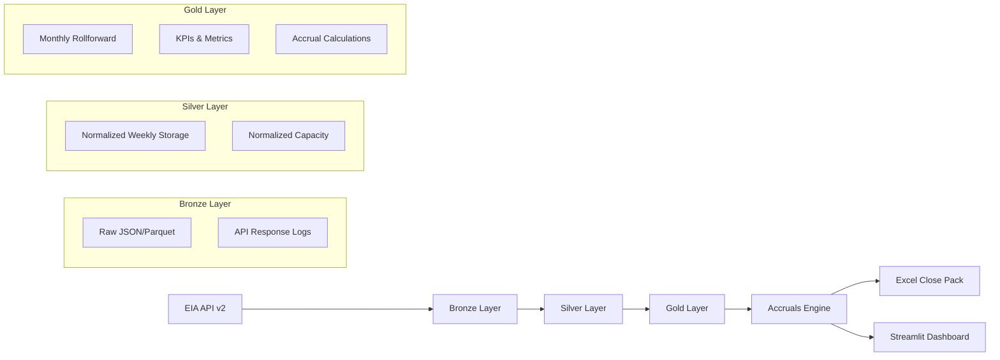
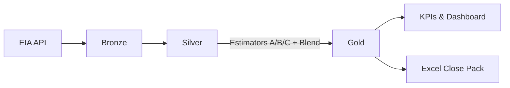

# EIA Storage Accrual Engine

**Production-grade tool for natural gas storage analysis and month-end accruals**

[](https://www.python.org/downloads/)
[](https://opensource.org/licenses/MIT)
[](https://github.com/psf/black)
[](https://pycqa.github.io/isort/)

## 🎯 Purpose

The EIA Storage Accrual Engine solves the critical business problem of **month-end storage accruals** for natural gas companies. It addresses the gap between EIA's weekly reporting cadence and accounting's monthly close requirements by:

- **Ingesting** EIA API v2 data (weekly storage, annual capacity)
- **Modeling** monthly rollforward estimates using three estimation strategies
- **Calculating** inventory accruals + storage fees with scenario analysis
- **Delivering** accountant-friendly Excel close packs and dashboards

## 🏗️ Architecture

### Data Flow


### Core Components

- **`ingest/`** - EIA API client with retry/backoff logic
- **`transform/`** - Data validation and normalization (bronze → silver → gold)
- **`accrual/`** - Estimation strategies and accrual calculations
- **`dashboard/`** - Streamlit app for accountants and operations
- **`cli/`** - Command-line interface for automation

## 🚀 Quick Start

### 1. Environment Setup

```bash
# Clone repository
git clone <your-repo-url>
cd eia-storage-accrual

# Install Poetry (if not already installed)
curl -sSL https://install.python-poetry.org | python3 -

# Install dependencies
poetry install

# Copy environment template
cp env.example .env
```

### 2. Configuration

Edit `.env` file with your EIA API key:

```bash
# Required
EIA_API_KEY=your_eia_api_key_here

# Optional overrides
DEFAULT_WACOG_PER_MMBTU=3.25
DEFAULT_TARIFF_FIXED_MONTHLY=120000
DEFAULT_TARIFF_INJECTION=0.02
DEFAULT_TARIFF_WITHDRAWAL=0.03
```

Get your free EIA API key from: https://www.eia.gov/opendata/

### 3. Data Ingestion

```bash
# Ingest weekly storage data (2010-present)
poetry run python -m cli.app ingest-weekly --start 2010-01-01

# Ingest capacity data
poetry run python -m cli.app ingest-capacity

# Check system status
poetry run python -m cli.app status
```

### 4. Build Data Models

```bash
# Transform bronze → silver
poetry run python -m cli.app build-silver

# Build gold layer (monthly rollforward)
poetry run python -m cli.app build-gold --asof 2025-08-31
```

### 5. Calculate Accruals

```bash
# Calculate month-end accruals
poetry run python -m cli.app calc-accruals \
  --asof 2025-08-31 \
  --wacog 3.25 \
  --tariff-fixed 120000 \
  --tariff-inj 0.02 \
  --tariff-wd 0.03
```

### 6. Launch Dashboard

```bash
# Start Streamlit dashboard
poetry run streamlit run dashboard/app.py
```

## 📊 Estimation Methods

The engine uses three complementary estimation strategies for monthly rollforward:

### Method A: Recent Trend (30% weight)
- **Logic**: Last 4 weeks average daily rate × gap days
- **Use case**: Captures recent operational patterns
- **Strengths**: Responsive to current conditions
- **Limitations**: Sensitive to weekly volatility

### Method B: Seasonality Model (20% weight)
- **Logic**: Month dummies + optional HDD/CDD variables
- **Use case**: Accounts for historical seasonal patterns
- **Strengths**: Captures predictable seasonal behavior
- **Limitations**: Requires sufficient historical data

### Method C: Operations Anchored (50% weight)
- **Logic**: Override with operations projections if available
- **Use case**: Incorporates forward-looking operational plans
- **Strengths**: Most accurate when ops data exists
- **Limitations**: Gracefully degrades when not available

### Blended Estimation
Final estimates use weighted averages: `0.3×A + 0.2×B + 0.5×C`

## 💰 Accrual Calculations

### Inventory Accrual
```
End Working Gas (BCF) × BCF→MMBtu Factor × WACOG ($/MMBtu)
```

### Variable Fees
```
(Est. Injections + Est. Withdrawals) × Respective Tariff Rates
```

### Fixed Demand
```
Monthly Fixed Tariff (regardless of activity)
```

### Scenario Analysis
- **Base**: Point estimate from blended estimator
- **Low**: Base × (1 - scenario_band)
- **High**: Base × (1 + scenario_band)

## 📁 Project Structure

```
eia-storage-accrual/
├── src/eia_sa/                 # Core package
│   ├── config.py               # Configuration management
│   ├── utils/                  # Utilities (logging, dates, units)
│   ├── ingest/                 # Data ingestion
│   │   └── eia_client.py      # EIA API client
│   ├── transform/              # Data transformation
│   │   └── schemas.py         # Data validation schemas
│   ├── accrual/                # Accrual engine
│   │   └── estimators.py      # Estimation strategies
│   └── analysis/               # Analysis and narratives
├── dashboard/                   # Streamlit dashboard
├── cli/                        # Command-line interface
├── tests/                      # Test suite
├── docs/                       # Documentation
├── data/                       # Data storage
│   ├── bronze/                 # Raw API data
│   ├── silver/                 # Normalized data
│   └── gold/                   # Business metrics
├── outputs/                     # Generated outputs
├── pyproject.toml              # Poetry configuration
└── README.md                   # This file
```

## 🔧 Development

### Code Quality

```bash
# Format code
poetry run black src/ tests/
poetry run isort src/ tests/

# Lint code
poetry run ruff check src/ tests/

# Type checking
poetry run mypy src/

# Run tests
poetry run pytest

# Pre-commit hooks
poetry run pre-commit install
poetry run pre-commit run --all-files
```

### Testing

```bash
# Run with coverage
poetry run pytest --cov=src/eia_sa --cov-report=html

# Run specific test file
poetry run pytest tests/test_estimators.py

# Run with verbose output
poetry run pytest -v
```

## 🎯 Quickstart (Monthly Close)

```bash
# 1) normalize
eia-sa build-silver

# 2) build gold (month-end projection using Methods A/B/C + blend)
eia-sa build-gold --asof 2025-08-31 --weights 0.3,0.2,0.5

# 3) calculate accruals + Excel close pack
eia-sa calc-accruals --asof 2025-08-31 --wacog 3.25 \
  --tariff-fixed 120000 --tariff-inj 0.02 --tariff-wd 0.03

# 4) Generate CFO & Ops narratives (Markdown files)
eia-sa narratives \
  --monthly-roll data/gold/monthly_storage_rollforward.parquet \
  --kpis-path data/gold/monthly_kpis.parquet \
  --accruals-path data/gold/accruals.parquet \
  --weights 0.3,0.2,0.5 \
  --scenario-band 0.10

# writes:
# outputs/narrative_cfo_YYYY-MM-DD.md
# outputs/narrative_ops_YYYY-MM-DD.md
```

### Flow


## 📚 Documentation

- **[Analytical Notes](docs/ANALYTICAL_NOTES.md)** - Methods, assumptions, limitations
- **[Data Dictionary](docs/DATA_DICTIONARY.md)** - Field definitions and lineage
- **[Monthly Close SOP](docs/SOP_MONTHLY_CLOSE.md)** - Step-by-step runbook, JE templates, and CFO/Ops narrative text you can paste into the close memo or export via the dashboard
- **[Verification Checklist](docs/VERIFICATION_CHECKLIST.md)** - Quality gates

## 🎨 Design Principles

### DRY (Don't Repeat Yourself)
- Shared utilities in `utils/`
- Common validation schemas
- Reusable estimation strategies

### KISS (Keep It Simple, Stupid)
- Single-purpose functions
- Clear data flow
- Minimal dependencies

### SOLID Principles
- **Single Responsibility**: Each class has one reason to change
- **Open/Closed**: Extensible through strategy pattern
- **Liskov Substitution**: Estimator strategies are interchangeable
- **Interface Segregation**: Clean, focused interfaces
- **Dependency Inversion**: High-level modules don't depend on low-level details

## 🚨 Limitations & Assumptions

### Data Limitations
- EIA API rate limits and availability
- Historical data completeness varies by region
- Capacity data updated annually

### Estimation Assumptions
- Linear interpolation between weekly reports
- Seasonal patterns remain consistent
- Operations projections are accurate when available

### Business Assumptions
- WACOG remains constant during month
- Tariff rates are fixed
- No storage constraints or operational issues

## 🤝 Contributing

1. Fork the repository
2. Create a feature branch (`git checkout -b feature/amazing-feature`)
3. Commit your changes (`git commit -m 'feat: add amazing feature'`)
4. Push to the branch (`git push origin feature/amazing-feature`)
5. Open a Pull Request

### Commit Convention
We use [Conventional Commits](https://www.conventionalcommits.org/):
- `feat:` New features
- `fix:` Bug fixes
- `docs:` Documentation changes
- `style:` Code style changes
- `refactor:` Code refactoring
- `test:` Test additions/changes
- `chore:` Maintenance tasks

## 📄 License

This project is licensed under the MIT License - see the [LICENSE](LICENSE) file for details.

## ⚠️ Disclaimer

This tool is for informational and analytical purposes only. It does not constitute financial, investment, or accounting advice. Users should validate all calculations and consult with appropriate professionals before making business decisions.

## 🆘 Support

- **Issues**: [GitHub Issues](https://github.com/your-org/eia-storage-accrual/issues)
- **Documentation**: [docs/](docs/) directory
- **Email**: your.email@example.com

---

**Built with ❤️ for the energy industry**
